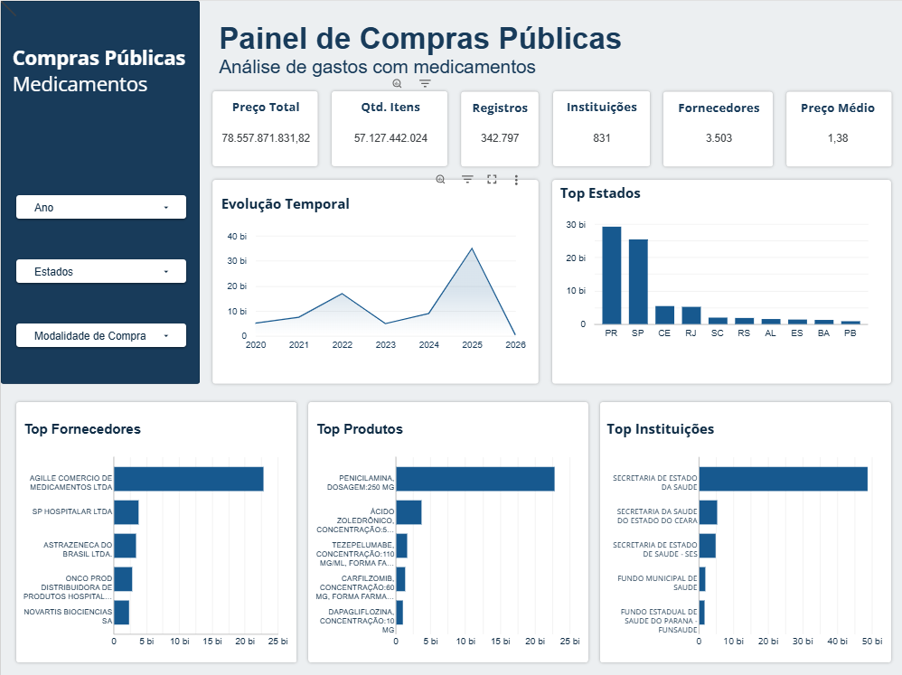

# Dashboard de Compras Públicas de Saúde (BPS 2020-2026)

**Autor:** Luiz Fernando de Jesus Silva Homem
**Turma: 2**
**Módulo 2 - Semana 07 - Mini-Projeto Avaliativo**

## Sobre o projeto

Esse projeto usa a base do Banco de Preços em Saúde (BPS), do Ministério da Saúde, pra montar um dashboard sobre as compras públicas de medicamentos e dispositivos médicos entre 2020 e 2026.

A ideia por trás disso é simples: quando o governo compra remédio, existe muito dinheiro público envolvido, muitos fornecedores diferentes, e é fácil perder a visão geral de quanto tá sendo gasto, com quem, e se os preços fazem sentido. Um dashboard bem feito ajuda a enxergar isso e apoiar decisões melhores na hora de comprar.

## De onde vieram os dados

- Base: [Banco de Preços em Saúde - BPS](https://dadosabertos.saude.gov.br/dataset/bps)
- Dicionário de dados oficial: [aqui](https://dadosabertos.saude.gov.br/dataset/bps/resource/0e76f527-5e7e-417d-9d0b-f46d00afb717)
- Peguei os arquivos de 2020 até 2026, um CSV por ano.

## Como baixei e juntei os arquivos

Baixei os 7 CSVs (2020 a 2026) direto do portal e coloquei numa pasta `bases_20_26/`. Depois usei Python (pandas) num Jupyter Notebook pra fazer tudo, investigando célula por célula em vez de rodar um script gigante de uma vez.

O primeiro problema que apareceu foi **o arquivo de 2020 tem uma estrutura totalmente diferente dos outros anos**. Os anos de 2021 a 2026 têm 25 colunas e usam nomes do tipo `uf`, `fornecedor`, `preco_total`. Já em 2020 tem 36 colunas, com nomes do tipo `sg_uf`, `no_fornecedor`, `vl_preco_total` (uma nomenclatura mais "de código", bem diferente).

Pra resolver isso, montei uma tabela de correspondência entre os dois formatos e renomeei as colunas de 2020 pro padrão dos outros anos. Segue a tabela:

| Coluna em 2020 | Virou |
|---|---|
| `sg_uf` | `uf` |
| `ds_esfera` | `esfera` |
| `dt_compra` | `compra` |
| `dt_insercao` | `insercao` |
| `co_catmat` | `codigo_br` |
| `ds_item` | `descricao_catmat` |
| `fg_generico` | `generico` |
| `tp_compra` | `tipo_compra` |
| `sg_unidade_medida` | `unidade_medida` |
| `no_fornecedor` | `fornecedor` |
| `no_fabricante` | `fabricante` |
| `qt_medicamento` | `qtd_itens_comprados` |
| `no_instituicao` | `nome_instituicao` |
| `no_municipio` | `municipio_instituicao` |
| `un_medida_capacidade` | `unidade_fornecimento_capacidade` |
| `un_fornecimento` | `unidade_fornecimento` |
| `registro_anvisa` | `anvisa` |
| `modalidade` | `modalidade_compra` |
| `vl_capacidade` | `capacidade` |
| `vl_preco_unitario` | `preco_unitario` |
| `vl_preco_total` | `preco_total` |

As colunas que só existem em 2020 e não têm equivalente nos outros anos (tipo `co_pdm`, `co_grupo`, `no_classe`, `nu_processo_compra`, `ds_observacao`, `validade_compra`, `co_seq_bps`) eu decidi manter na base final, mesmo sabendo que vão ficar vazias pros anos de 2021 a 2026 (porque esses anos nunca tiveram essas colunas).

Depois disso foi só concatenar tudo com `pandas.concat()` e salvar como `BPS_20_26_LuizFernandoDeJesusSilvaHomem.csv`.

## Limpeza e tratamento dos dados

A parte que deu mais trabalho. Fui investigando cada coisa antes de decidir o que fazer.

**Datas:** `compra` e `insercao` vieram como texto (`dd/mm/yyyy`), converti pra datetime de verdade. A `insercao` ficou com 2.128 nulos, mas confirmei que já vinha vazia assim na base original do governo, não foi erro meu na conversão.

**A coluna `nu_ata`:** decidi tirar ela da base. Motivo: em quase todos os anos ela vem 100% vazia, e mesmo em 2020 (o único ano que tem algum valor) só 564 de quase 85 mil linhas estavam preenchidas. Além disso, achei um caso onde a compra era de 2020 mas o número da ata referenciava "2022" - deu pra ver que não é um campo confiável.

**Nulos em geral:** mapeei todas as colunas com valor faltando. A maioria faz sentido:
- As colunas exclusivas de 2020 ficam ~75% nulas na base toda, simplesmente porque não existem nos outros 6 anos. Dentro do próprio 2020 elas estão 99,89% preenchidas, então tá tudo certo.
- `generico`/`anvisa` e `unidade_medida`/`capacidade` ficam nulos sempre juntos (testei isso), o que indica que são campos que só se aplicam a medicamento, não a dispositivo médico. Faz sentido manter vazio.
- `nome_instituicao` tinha 157 nulos, mas consegui recuperar todos usando o CNPJ da instituição (procurei outras linhas com o mesmo CNPJ que já tinham o nome preenchido, e usei pra completar). Ficou 0 nulo depois disso.

**Duplicatas:** achei 38 linhas 100% idênticas em tudo (removidas). Depois fui atrás de "duplicatas parecidas" (mesma instituição, produto, data e quantidade, mas diferindo em algum outro campo) e achei 3.551 linhas suspeitas. Investigando mais, vi que quando o preço batia igual entre duas linhas parecidas, a diferença tava no fabricante ou no registro da ANVISA, e o número de sequência do BPS (`co_seq_bps`) era consecutivo - ou seja, é o mesmo processo de compra dividido entre dois fabricantes/fornecedores, não um erro de duplicação. Não removi nada dessas.

**CNPJ com zero perdido:** aqui foi importante. Reparei que os CNPJs vinham em formatos diferentes - alguns com 18 caracteres (com ponto e traço), outros com só 14, 13 ou até 12 dígitos. Os com 13 e 12 tinham perdido o zero à esquerda. Se não corrigisse isso, ia contar a mesma instituição como se fosse duas diferentes. Limpei a pontuação e completei com zero à esquerda até 14 dígitos em `cnpj_instituicao`, `cnpj_fornecedor` e `cnpj_fabricante`.

**Nomes com grafia diferente:** depois de arrumar o CNPJ, conferi se o mesmo CNPJ tinha nomes diferentes de instituição/fornecedor/fabricante associados. Achei alguns casos de espaço duplo no meio do nome (tipo "FUNDO  MUNICIPAL" com dois espaços) e corrigi isso pra todo mundo. Dois casos de instituição eu decidi não mexer, porque pareciam mudança de nome real (tipo um consórcio que foi reestruturado), não erro de digitação.

**Codificação de caracteres:** conferi se tinha algum problema de acento quebrado (tipo "ç" no lugar de "ç"). Não achei nenhum problema real, os textos tão certos.

**Colunas de código viraram número quebrado:** `co_pdm`, `co_grupo`, `co_classe`, `anvisa` e `co_seq_bps` são identificadores, mas como tinham nulo, o pandas leu como decimal e ficou tipo `13869160.0`. Converti pra um tipo de inteiro que aceita nulo (`Int64`) só pra tirar esse `.0` que não fazia sentido ali.

## Sobre a coluna `validade_compra`

Fiquei em dúvida no começo se isso era uma data ou não, porque o nome sugere "data de validade" mas os valores eram tudo número pequeno (a maioria 12). Entendi que poderia se tratar de quantos meses de validade o produto tinha.

Achei também 4 registros com valor 90 (meses), todos da mesma prefeitura, em itens de teste/reagente comprados por dispensa de licitação durante a pandemia. Não corrigi porque não tenho como confirmar se é erro ou uma condição real daquele contrato específico.

## Colunas principais da base

| Coluna | O que é |
|---|---|
| `ano_compra` | ano da compra |
| `cnpj_instituicao` / `nome_instituicao` | quem comprou |
| `uf` / `municipio_instituicao` | onde |
| `compra` | data da compra |
| `insercao` | data que o registro entrou no sistema |
| `codigo_br` / `descricao_catmat` | código e nome do produto |
| `fornecedor` / `cnpj_fornecedor` | quem vendeu |
| `fabricante` / `cnpj_fabricante` | quem fabricou |
| `qtd_itens_comprados` | quantidade comprada |
| `preco_unitario` | preço de cada unidade |
| `preco_total` | valor total daquela linha |
| `modalidade_compra` | como foi a compra (pregão, dispensa, etc) |
| `unidade_fornecimento` | em que unidade o item vem (frasco, ampola, comprimido...) |
| `validade_compra` | meses de validade do preço registrado |

## KPIs

O desafio pede 6 KPIs obrigatórios. Calculei todos e testei no Python antes de levar pro dashboard, pra garantir que a lógica tava certa:

| KPI | Como calcula | Valor |
|---|---|---|
| Valor total registrado | soma de `preco_total` | R$ 78.557.871.831,82 |
| Quantidade total de itens | soma de `qtd_itens_comprados` | 57.127.442.024 |
| Número de registros | contagem de linhas | 342.797 |
| Instituições compradoras | CNPJs distintos de instituição | 831 |
| Fornecedores | CNPJs distintos de fornecedor | 3.503 |
| Preço unitário médio ponderado | soma(preco_total) / soma(qtd_itens_comprados) | R$ 1,3751 |

Dois pontos que valem atenção nesses números:

- No KPI de **quantidade total**, descobri que só 10 registros (de 342 mil!) já representam mais de 16% de toda a soma. São compras de itens medidos em mililitro ou coisas do tipo, com volumes bem altos. Conferi se a matemática interna batia (preço unitário x quantidade = preço total) e bateu certinho em todos, então não parece erro de digitação isolado, mas também não dá pra ter 100% de certeza que é normal. De qualquer forma, é bom saber que esse número tá bem concentrado em pouca coisa.

- O **preço médio ponderado** sofre exatamente esse mesmo problema, porque usa a mesma soma de quantidade no cálculo. Deu R$ 1,38, enquanto a média simples (sem ponderar) dá R$ 171,32 - uma diferença grande. Isso acontece porque tem muito item de baixo valor e alto volume puxando o ponderado pra baixo. Esse KPI só faz sentido de verdade se for filtrado por categoria de produto parecido, não pra base inteira misturada.

## Dashboard

Montei o dashboard no Looker Studio, conectado numa tabela do BigQuery (subi o CSV tratado pra lá porque o arquivo passava do limite de 100MB do Looker). Ele tem os 6 KPIs no topo, 5 gráficos e 3 filtros (Ano, Estado, Modalidade de Compra) que afetam tudo na tela.



## Principais análises

Fui olhando gráfico por gráfico depois que terminei de montar, e reparei em alguns padrões:

**Obs: Valores estimativos pois eu arredondei para simplificar.**
**Evolução por ano:** o valor total sobe de 2020 (R$5 bi) até 2022 (R$16 bi), cai bastante em 2023 (R$4 bi), sobe de novo em 2024 (R$8 bi) e dá um salto grande em 2025, chegando a R$34 bi. Em 2026 aparece quase zerado (R$400 mil), mas isso não é uma queda de verdade — é porque 2026 ainda tá em andamento e só tem os primeiros meses registrados na base.

**Estados:** Paraná (R$29 bi) e São Paulo (R$25 bi) aparecem bem na frente dos outros estados, e juntos os dois somam mais da metade de tudo que foi gasto na base inteira.

**Fornecedores:** percebi que o maior fornecedor do ranking `AGILLE COMERCIO DE MEDICAMENTOS LTDA`, tem um valor 5 vezes maior que o segundo colocado. E o mais interessante: mesmo somando os 4 fornecedores seguintes do ranking, ainda dá quase metade do que só esse primeiro fornecedor tem sozinho.

**Produtos:** o item que mais aparece em valor comprado é a `Penicilamina`, com um valor quase 3 vezes maior que os itens logo depois dele no ranking.

**Instituições:** a `SECRETARIA DE ESTADO DA SAUDE` é a instituição que mais compra, com um valor 3 vezes maior que a segunda colocada.

Juntando tudo isso, dá pra notar um padrão que se repete em vários gráficos diferentes: **tem muita concentração**. A base tem 831 instituições e 3.503 fornecedores no total, só que boa parte do dinheiro passa por bem poucos deles. Isso também bate com uma coisa que eu já tinha percebido lá na limpeza dos dados: só 10 registros (de 342 mil) já representam 16% de toda a quantidade de itens comprados. Ou seja, não é só "quem" compra ou vende que é concentrado — até "quanto" pesa cada compra individual também é bem desigual.

## Recomendações

- Como o gasto está bem concentrado em poucos fornecedores (principalmente o primeiro do ranking), vale a pena investigar se isso é um risco de dependência — se esse fornecedor tiver algum problema, pode afetar bastante o abastecimento.
- O mesmo vale pro lado das instituições: uma secretaria estadual concentra muito mais gasto que as outras, o que pode ser normal (ela pode centralizar compra pra vários municípios), mas seria bom confirmar isso com mais contexto antes de tirar conclusão.
- Os dados de 2026 ainda não devem ser comparados com os anos anteriores em gráficos de evolução, porque o ano não fechou — dá uma impressão errada de "queda".
- Recomendo usar o filtro de Modalidade de Compra pra comparar, por exemplo, se Pregão tem preço médio diferente de Dispensa de Licitação — isso pode revelar se uma modalidade tende a ser mais cara que outra.

## Limitações que encontrei

- Tirei a coluna `nu_ata` por ser praticamente toda vazia e ter uma inconsistência entre ano de compra e ano da ata.
- `validade_compra` só existe pra 2020 e tem alguns valores fora do padrão (o caso dos 90 meses) que não tive como confirmar se é erro ou não.
- Quantidade total e preço médio ponderado são bem sensíveis a poucos registros de alto volume - documentei isso acima, mas fica o alerta pra quem for usar o dashboard.
- As colunas de classificação de produto (grupo, classe, PDM) só existem pra 2020, então qualquer análise que use isso fica limitada a 24% da base.
- `generico`, `anvisa`, `unidade_medida` e `capacidade` ficam vazios pra itens que não são medicamento - isso é esperado, não é falha na base.

## Como rodar o projeto

Precisa de Python com pandas instalado:

```
pip install pandas
```

Passo a passo:

1. Baixa os csv de 2020 a 2026 no site do BPS e coloca numa pasta `bases_20_26/`, nomeando como `2020.csv`, `2021.csv` etc.
2. Abre o `analise_bps.ipynb` no VS Code (ou Jupyter).
3. Seleciona o kernel do venv do projeto.
4. Roda tudo (Run All). Isso vai ler os 7 arquivos, padronizar as colunas, juntar tudo, limpar os dados, calcular os KPIs e salvar o CSV final `BPS_20_26_LuizFernandoDeJesusSilvaHomem.csv`.
5. Depois é só conectar esse CSV no Looker Studio ou Power BI pra montar o dashboard.
